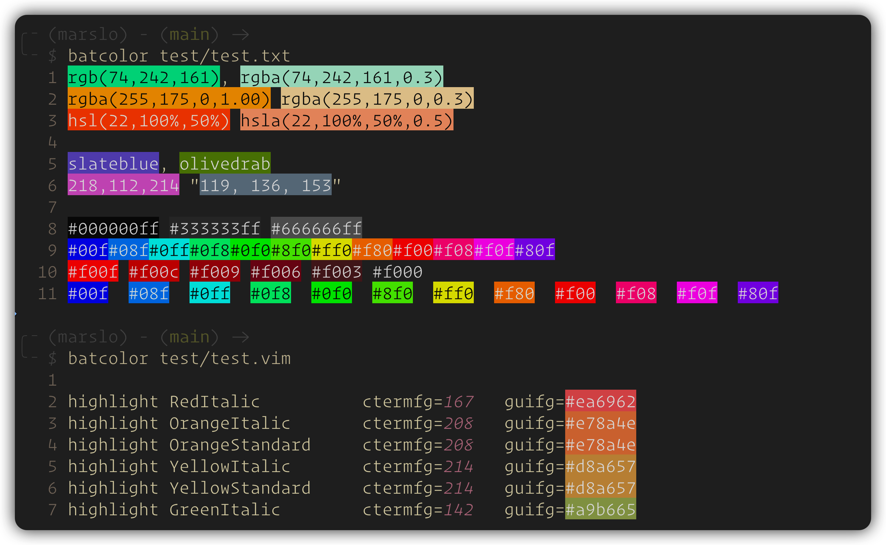
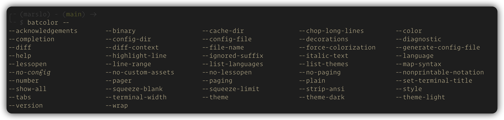
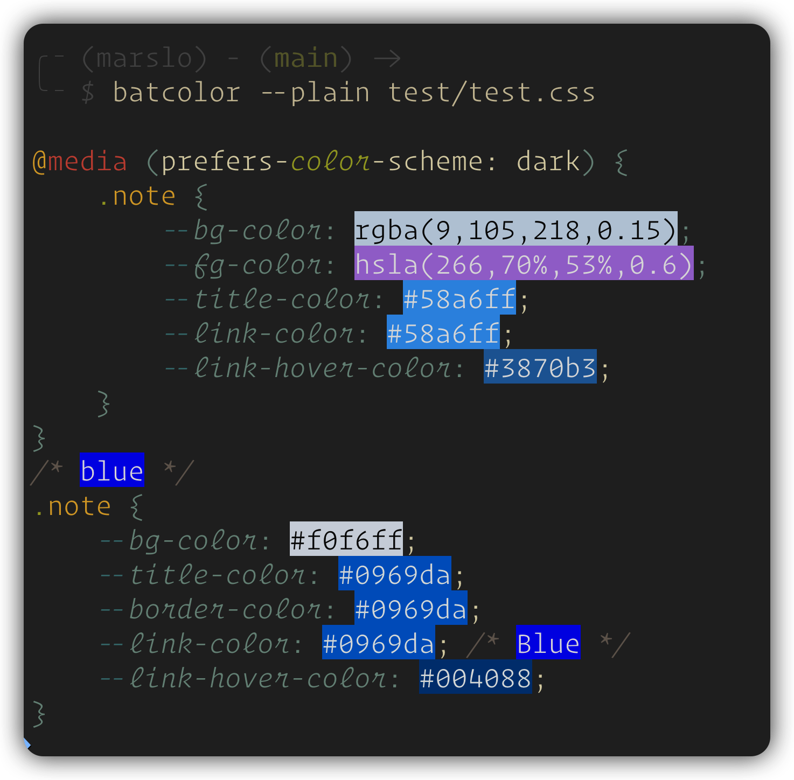
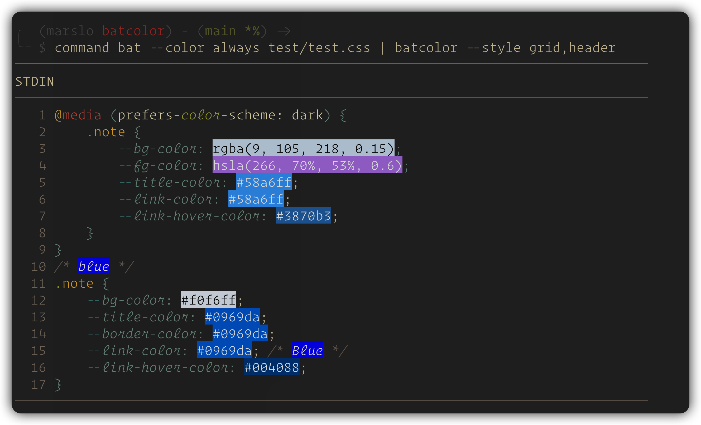
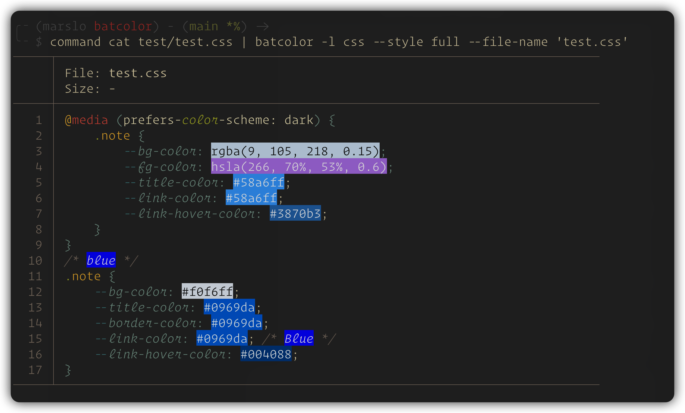
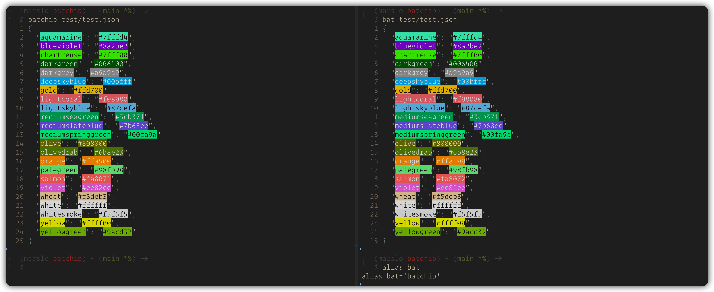

# batcolor

A powerful wrapper for bat that instantly renders CSS color codes (Hex, RGB, HSL, Named Colors) in your terminal using TrueColor, featuring smart contrast (Rec. 709 Luma) and alpha blending

---


`batcolor` is a wrapper around the popular [`bat`](https://github.com/sharkdp/bat) command-line tool. It intercepts the output and **colorizes hex codes, rgb/hsl values, and named CSS colors** directly in your terminal, bringing `vim-hexokinase` or modern IDE color preview capabilities to your CLI.

Unlike simple text-matching scripts, `batcolor` is built with a sophisticated rendering engine that respects human visual perception and terminal limitations.

---

## demo

> [!TIP]
> - check [`fzf-preview.sh`](https://github.com/marslo/dotfiles/raw/main/.marslo/bin/fzf-preview.sh) for full support

<video src="https://github.com/user-attachments/assets/268202bc-e600-464f-8f4c-0e674f9e444d" width="100%" autoplay loop muted playsinline>batcolor integrate with fzf-preview</video>



---

## Features

- **Broad Format Support**: Parses and colorizes almost all standard color formats:
  - *Hex**: 3, 4, 6, and 8-bit hex codes (e.g., `#fff`, `#AAbB11aa`, `"A0CC2F"`).
  - **RGB/RGBA**: `rgb(74, 242, 161)`, `rgba(74, 242, 161, 0.3)`.
  - **HSL/HSLA**: `hsl(120, 100%, 50%)`, `hsla(120, 100%, 50%, 0.5)`.
  - **Bare Tuples**: `255, 50, 127` or `218,112,214`.
  - **Named Colors**: `slateblue`, `olivedrab`, `aliceblue`, etc.
  - **Smart Contrast (Rec. 709 Luma)**: Automatically calculates the perceived brightness of the background color and switches the foreground text to absolute Black or White for maximum readability. It accurately handles high-luminance colors like pure green (`#00ff00`).
  - **Alpha Blending**: Fully supports opacity in 4/8-bit Hex and RGBA/HSLA by calculating real-time alpha blending against a dark terminal background.
  - **TrueColor Isolation**: Uses 24-bit TrueColor (`\033[38;2;...`) for both background and foreground, completely bypassing terminal ANSI palette overrides (like those in Gruvbox, Dracula, etc.) to ensure 100% color accuracy.
  - **Seamless `bat` Integration**: Forwards all arguments (like `--paging`, `-l`) directly to `bat`. It preserves your existing syntax highlighting and layout.

## Installation

### Prerequisites
Make sure you have the following installed on your system:
- [x] `bat`
- [x] `perl` (with `JSON::PP` module, usually pre-installed)
- [x] `curl` (for initial color-names JSON download)

### Setup

```bash
curl -fsSl -O ~/.local/bin/batcolor https://github.com/marslo/batcolor/raw/main/batcolor
chmod +x ~/.local/bin/batcolor
```

#### setup bash completion

```bash
# put into ~/.bashrc or ~/.bash_profile
type -P batcolor >/dev/null && complete -o default -o bashdefault -F _bat batcolor
```



#### optionally, set `COLOR_NAMES_JSON` environment variable

> [!NOTE]
> - the `css-color-names.json` will download automatically on first run

```bash
# manual download show color names
curl -fsSL -o "${COLOR_NAMES_JSON:-$HOME/.config/css-color-names.json}" \
     https://github.com/bahamas10/css-color-names/raw/master/css-color-names.json
```

## Usage

### run as command
```bash
# preview a css file with inline colors
batcolor styles.css

# use bat arguments (e.g., specific language and line numbers)
batcolor -l javascript index.js
```



### run as a filter (pipe)

> [!TIP]
> - to preserves syntax highlighting with bat in piped mode, make sure to include `--color=always`
> - without `--color=always`:
>   ```bash
>   $ command bat style.css | command cat -A
>   .note { --bg-color: rgba(9, 105, 218, 0.15) }$
>   ```
> - with `--color=always`:
>   ```bash
>   $ command bat --color always style.css | command cat -A
>   ^[[38;2;146;131;116m   1^[[0m ^[[38;2;184;187;38m.^[[0m^[[38;2;250;189;47mnote^[[0m^[[38;2;251;241;199m ^[[0m^[[38;2;131;165;152m{^[[0m^[[38;2;251;241;199m ^[[0m^[[3;38;2;69;133;136m--^[[0m^[[3;38;2;131;165;152mbg-color^[[0m^[[38;2;131;165;152m:^[[0m^[[38;2;251;241;199m ^[[0m^[[38;2;142;192;124mrgba^[[0m^[[38;2;189;174;147m(^[[0m^[[3;38;2;211;134;155m9^[[0m^[[38;2;131;165;152m,^[[0m^[[38;2;251;241;199m ^[[0m^[[3;38;2;211;134;155m105^[[0m^[[38;2;131;165;152m,^[[0m^[[38;2;251;241;199m ^[[0m^[[3;38;2;211;134;155m218^[[0m^[[38;2;131;165;152m,^[[0m^[[38;2;251;241;199m ^[[0m^[[3;38;2;211;134;155m0^[[0m^[[3;38;2;131;165;152m.^[[0m^[[3;38;2;211;134;155m15^[[0m^[[38;2;189;174;147m)^[[0m^[[38;2;251;241;199m ^[[0m^[[38;2;131;165;152m}^[[0m$
>   ```

```bash
# pipe output into batcolor
cat palette.json | batcolor -l json

# using bat --color=always to preserve syntax highlighting in piped mode
bat --color=always style.css | batcolor
```





### alias to bat
```bash
alias bat='batcolor'

# or
alias bat='/path/to/batcolor'
```



### fzf-preview

```bash
declare _BAT_CMD=$(type -P batcolor || type -P batcat || type -P bat)
# define bat options base on your preferences
if [[ -n "${_BAT_CMD}" ]]; then
  _BAT_CMD+=( --style="${BAT_STYLE:-numbers}" --theme='Nord' --color=always --pager=never --line-range :500 )
fi

# and view file with
"${_BAT_CMD[@]}" -- {}
```

# How it Works (The Math)

> [!TIP]
> Why not just use standard ANSI colors?
> Standard terminal ANSI bright white (index `97`) or black (index `30`) are often "softened" by terminal color schemes (e.g., turned into off-white or dark gray). When placing text over a vividly colored background, this causes muddy contrast and subpixel anti-aliasing artifacts

batcolor solves this by:

- **Luma Calculation**: Utilizing the `Rec. 709` algorithm (`0.2126 * R + 0.7152 * G + 0.0722 * B`) to simulate human eye sensitivity to green light, ensuring text flips to black exactly when the background becomes subjectively "bright"
- **Absolute RGB**: Outputting strict `\033[38;2;255;255;255m` and `\033[38;2;0;0;0m` to force the terminal to render pure contrasting text

## License
This project is licensed under the MIT License. See the [LICENSE](LICENSE) file for details.
